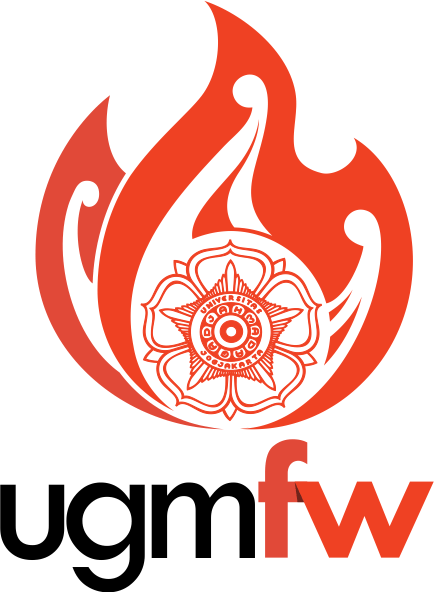

# UGM Framework

  

    <em>Membangun Harmoni Sistem Informasi</em>

---

## **Transformasi UGM Framework**

**UGM Framework (UGMFW)**, yang sebelumnya dibangun dengan **PHP CodeIgniter (CI)**, kini mengalami perubahan besar. UGMFW tidak lagi terbatas pada framework berbasis CodeIgniter, melainkan akan bertransformasi menjadi **panduan teknis pengembangan sistem informasi** yang seragam dan fleksibel. Transformasi ini bertujuan untuk mengatasi keterbatasan teknologi yang sudah usang dan memastikan bahwa pengembangan sistem informasi di UGM lebih efisien, terstruktur, dan dapat mengikuti perkembangan teknologi terbaru.

---

## **Pembaruan Teknologi dan Pendekatan**

UGMFW kini mengarah pada **API first design** dengan fokus pada pengembangan **modular monolit**. Dalam pendekatan ini, API akan menjadi inti dari pengembangan aplikasi, memastikan interoperabilitas yang lebih baik antar sistem dan memungkinkan sistem untuk lebih mudah beradaptasi dengan teknologi baru. Dengan pendekatan **API-first**, seluruh aplikasi dan sistem informasi di UGM akan dibangun di sekitar API yang jelas dan terstandarisasi, sehingga memudahkan pengembangan dan integrasi di berbagai platform.

---

## **Visi dan Misi Baru**

UGMFW kini bertujuan untuk menyelaraskan pengembangan sistem informasi dengan **praktik terbaik** dan **teknologi terkini**, untuk menciptakan sebuah platform yang lebih modular dan adaptif. Visi kami adalah untuk merancang dan mengembangkan kerangka kerja yang **handal**, **modular**, **aman**, dan mendukung **interoperabilitas** antara sistem informasi yang ada di UGM.

### **Misi UGMFW**

- Meningkatkan **efisiensi pengembangan** dengan menyediakan **panduan teknis** yang jelas dan standar pengembangan yang selaras.
- Menyediakan **landasan teknologi** yang relevan dan fleksibel, mendukung berbagai framework dan kebutuhan pengembangan.
- Mengedepankan **kolaborasi yang lebih luas** di lingkungan UGM, memfasilitasi pengembang dalam bekerja dengan alat dan standar yang seragam.

---

## **Tujuan UGMFW yang Baru**

UGMFW kini berfokus pada pengembangan **tatanan pengembangan yang seragam dan terstandarisasi** untuk memastikan setiap pengembang di UGM memiliki pola dan perilaku pengembangan yang sama. Berikut adalah tujuan utama UGMFW yang baru:

### **Penyelarasan Tatanan Pengembangan**
UGMFW menyediakan standar **design patterns** yang konsisten untuk memastikan bahwa setiap aplikasi dikembangkan dengan struktur kode yang mudah dipahami, terorganisir dengan baik, dan bebas dari bug.

### **Penyelarasan Perilaku Pengembangan**
Semua pengembang di UGM diharapkan menggunakan **toolset** yang seragam dan mengikuti **standar kode** yang konsisten. Panduan pengembangan yang lebih lengkap akan mencakup dokumentasi kode, penamaan variabel, struktur kode, serta standar pengujian untuk memastikan kualitas aplikasi yang lebih baik.

### **Standar Pengalaman Pengguna**
UGMFW menetapkan standar **material design** yang konsisten untuk pengalaman pengguna yang lebih baik. Setiap aplikasi yang dikembangkan menggunakan UGMFW akan memiliki antarmuka yang familiar, memudahkan pengguna dalam berinteraksi dengan sistem.

### **Pembaruan Teknologi dan DevOps Ideal**
UGMFW akan menyediakan panduan pengembangan yang ideal untuk memastikan implementasi **Continuous Integration** dan **Continuous Delivery (CI/CD)** yang efektif. Setiap perubahan kode akan diuji dan diterapkan secara otomatis, memungkinkan pengembang untuk fokus pada pengembangan tanpa mengkhawatirkan gangguan akibat integrasi manual.

---

## **Pengembangan API dan Modular Monolit**

Salah satu langkah besar dalam transformasi UGMFW adalah peralihan ke **API first design**. Sistem informasi di UGM akan berfokus pada pengembangan **API** yang menjadi fondasi bagi semua aplikasi yang dibangun di atasnya. Pendekatan ini memungkinkan aplikasi untuk lebih fleksibel, lebih mudah diintegrasikan, dan lebih modular. API yang dikembangkan akan mengikuti **standar yang telah ditentukan**, memastikan bahwa sistem informasi di UGM dapat berinteroperasi dengan baik.

Dengan ini, UGMFW mengarah pada pengembangan **modular monolit**, dimana aplikasi tetap memiliki satu kesatuan arsitektur namun dengan modularitas yang tinggi berkat penggunaan API yang jelas dan terstandarisasi.

---

## **Transformasi Menuju Harmoni Sistem Informasi**

Transformasi UGMFW adalah langkah penting untuk meningkatkan kualitas pengembangan sistem informasi di Universitas Gadjah Mada. Dengan mengedepankan **modularitas**, **fleksibilitas**, dan **keamanan**, UGMFW akan menjadi fondasi yang kokoh bagi pengembangan sistem informasi di masa depan. Pembaruan teknologi, dokumentasi yang lebih jelas, dan standar pengembangan yang konsisten akan memperkuat kualitas aplikasi di lingkungan UGM.

Kami percaya bahwa dengan panduan ini, UGMFW akan mendukung integrasi dan kolaborasi yang lebih baik di seluruh unit dan fakultas, mempercepat transformasi digital yang lebih efisien dan aman.

---

## **Terima Kasih**

Kami mengucapkan terima kasih kepada semua pihak yang telah berkontribusi dalam penyusunan panduan ini, khususnya kepada:

- Rektor Universitas Gadjah Mada
- Wakil Rektor Universitas Gadjah Mada
- Direktur Teknologi Informasi
- Sekretaris Direktorat Teknologi Informasi
- Kepala Sub Bidang Direktorat Teknologi Informasi
- Koordinator Fungsional Direktorat Teknologi Informasi
- Tim Task Force UGM Framework, Simaster vNext, UGM Lean, dan Modernisasi Data
- Semua pihak yang terlibat, baik secara langsung maupun tidak langsung

Semoga panduan ini dapat memberikan kontribusi signifikan dalam peningkatan kualitas sistem informasi di Universitas Gadjah Mada.

---

## **Pelajari Lebih Lanjut**
Temukan dokumentasi lengkap UGMFW untuk mulai membangun aplikasi Anda.
