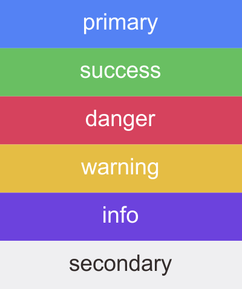
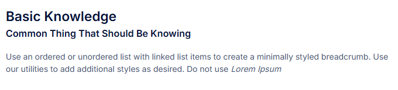
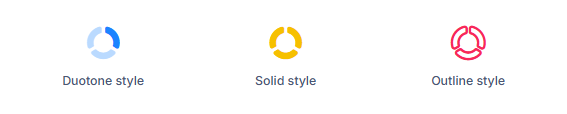

Pengembangan aplikasi berbasis web di lingkungan internal sampai saat ini masih mengadopsi template Pixel Admin (versi lama), yang saat ini statusnya telah usang (*deprecated*) dan telah merilis versi baru dari Pixel Admin.

Namun, mulai saat ini dan pada pengembangan berikutnya, akan digunakan template baru, yaitu template Metronics dari Keenthemes sebagai sistem desain utama untuk penyusunan tampilan/*user interface*. Saat ini, dokumentasi dan pratinjau template (*preview template*) hanya dapat diperoleh dengan mengajukan permohonan langsung atau mengunjungi laman pembuatnya [di sini](https://preview.keenthemes.com/metronic8/demo1/).

Kedepan, dokumentasi dan pratinjau langsung template (*live preview template*)

dapat diunggah ke publik sehingga dapat diakses oleh setiap pengembang di lingkungan internal.

Adapun elemen visual yang akan ditetapkan ketentuannya meliputi:

- **Warna (Color Palette)**
    
    Menjelaskan definisi penggunaan warna yang akan digunakan dalam penyusunan tampilan. Dalam template, warna dapat didefinisikan dengan menyertakan nama warna, kode warna serta penggunaannya dalam komponen UI. 
    
    | Nama Kelas | Kode |
    | --- | --- |
    | primary | #1B84FF |
    | success | #17C653 |
    | danger | #F8285A |
    | warning | #F6C000 |
    | info | #7239EA |
    | default | #F1F1F4 |
    
    
    
- **Tipografi**
    
    Penentuan jenis font, berat, ukuran dan gaya yang digunakan dalam pengembangan tampilan. Secara default, setiap template yang digunakan juga telah menyediakan `class` untuk tipografi. Pada template Metronics *font family* utama yang digunakan adalah Sans-Serif.
    
    Redaksional aplikasi umumnya terdiri terdiri dari 3 bagian, yaitu *Heading*, *Sub-Heading*, *Description*. Pada bagian heading dapat menggunakan tag `<h1></h1>`. Untuk sub-heading dapat menggunakan `<h4></h4>`. Sedangkan untuk bagian *description*, dapat menggunakan teks biasa. Untuk menambahkan elemen estetika, dapat ditambahkan jarak antar bagian. Misalnya, pada bagian heading ditambahkan class `mb-2`, kemudian dibawah sub-heading ditambahkan class `mb-4`.  Lalu untuk *styling text,* dapat menggunakan class `fw-bold` untuk mempertebal huruf, dan class `fst-italic` untuk mencetak miring. 
    
    Berikut merupakan hasil penataan tipografi untuk suatu konten.
    
    
    
- **Spacing**
    
    **Spacing** mengacu pada pengaturan jarak antar elemen teks untuk menciptakan tampilan yang lebih rapi, mudah dibaca, dan estetis. Spacing mencakup jarak antara huruf, kata, baris, atau elemen teks secara keseluruhan. Dalam desain grafis, spacing sangat penting karena dapat memengaruhi **keterbacaan**, **hierarki visual**, dan **estetika desain**. Seperti pada contoh tipografi di atas, spacing diterapkan pada elemen heading dan sub-heading dengan menambahkan class `mb-2` dan `mb-4`.
    
- **Ikonografi**
    
    Desain ikon digunakan untuk membantu navigasi dan menyampaikan fungsi dengan cepat. Ikon yang baik adalah ikon yang konsisten dan selaras dengan maksud yang hendak disampaikan, sehingga pengguna dapat memahami arti dari ikon tersebut tanpa kebingungan. 
    
    Dalam template Metronics, sudah tersedia paket ikon *build-in* dari pengembang yang diberi nama KeenIcons. Keenicons menawarkan tiga gaya ikon yang berbeda, yaitu *duotone*, *solid*, dan *outline*. Pemilihan gaya ikon oini sepenuhnya tergantung pada keinginan atau kesepakatan pengembang *project*, dan tidak ada kewajiban untuk menggunakan *duotone*, atau *solid*, atau *outline*. Namun, **disarankan untuk memilih style yang konsisten dalam satu *project.*** Sebagai contoh, misalkan aplikasi “A” menggunakan style *duotone* dan aplikasi “B” menggunakan *solid*.
    
    Berikut adalah contoh kode dan ikon yang dihasilkan:
    
    ```css
    <i class="ki-duotone ki-chart text-primary">
        <i class="path1"></i>
        <i class="path2"></i>
    </i>
    
    <i class="ki-solid ki-chart text-warning"></i>
    
    <i class="ki-outline ki-chart text-danger"></i>
    ```
    
    
    
- **Ilustrasi**
    
    Ilustrasi merupakan karya visual yang digunakan untuk menjelaskan, memperjelas, atau memperindah suatu konsep, teks, cerita, atau ide yang hendak disampaikan. Visual ini sebaiknya mencerminkan identitas merek dan memberikan nuansa yang sesuai dengan target audiens. 
    
    Dalam template Metronics, juga disertakan beberapa gambar ilustrasi yang dapat digunakan oleh pengembang *user interface*. Apabila hendak menggunakan gambar ilustrasi original, tentu diperbolehkan. Sangat disarankan agar gambar ilustrasi tersebut dapat terlihat jelas pada mode terang maupun gelap. Gambar ilustrasi bawaan template Metronics terletak pada direktori `assets/media/ilustrations`.