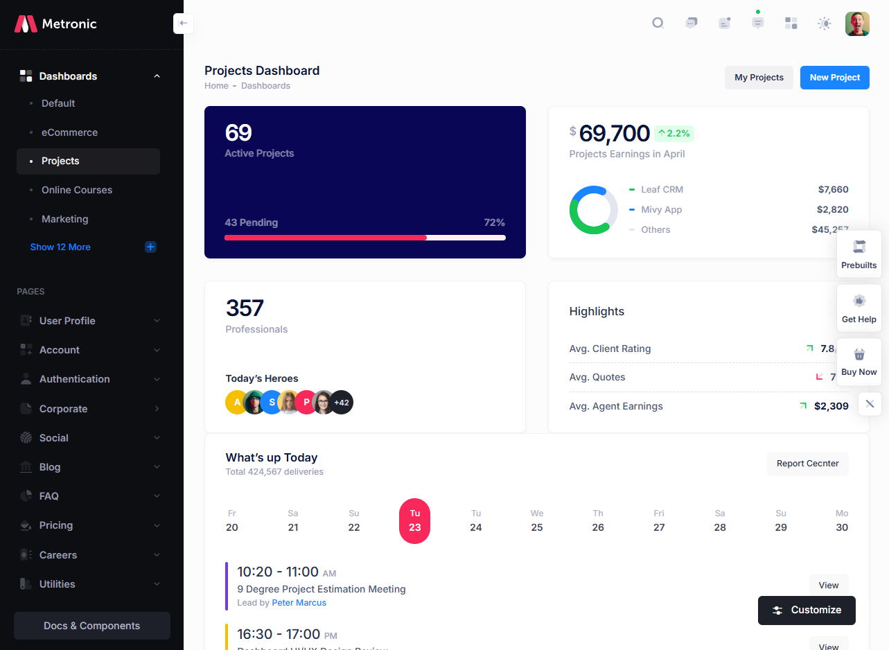
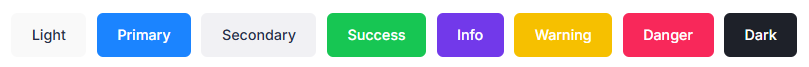
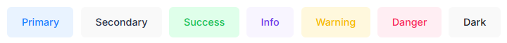
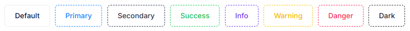
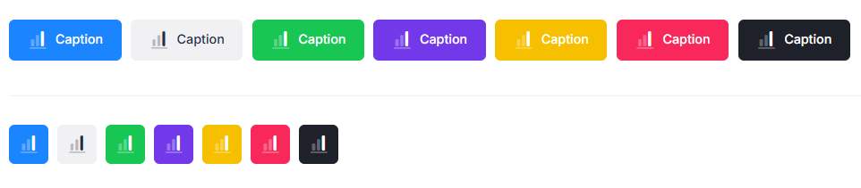
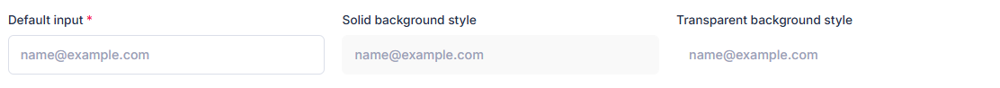
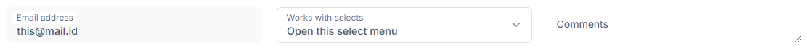
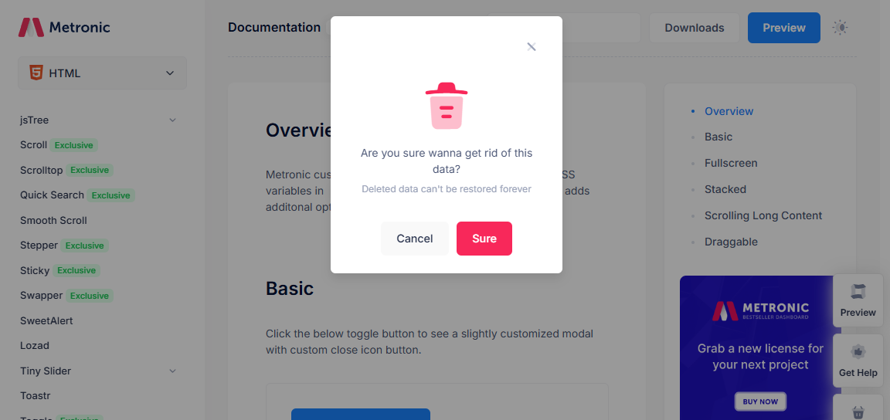

Komponen UI merupakan adalah elemen-elemen kecil bagian desain yang digunakan untuk membangun antarmuka pengguna yang konsisten dan fungsional. Dalam dokumentasi template metronic menyediakan dokumentasi yang lengkap mulai dari layouting sampai komponen-komponen terkecilnya. Disini hanya akan membahas komponen-komponen yang dianggap fundamental yang memiliki pengaruh dalam terciptanya konsistensi user interface.

### 10.4.1 Navigasi

Navigasi adalah elemen yang membantu pengguna berpindah antara layar atau bagian aplikasi. Desain navigasi yang konsisten dan intuitif sangat penting untuk pengalaman pengguna yang baik. Dalam template menyediakan 2 tipe navigasi, yaitu di bagian atas dan dibagian samping. Untuk keperlua Back Office admin biasanya menggunakan navigasi di bagian samping (sidebar) untuk mengakomodasi jumlah menu yang sering bertambah seiring waktu. Sedangkan untuk landing page atau portal biasanya menggunakan navigasi atas dengan menggunakan mega menu.

Berikut merupakan contoh navigasi di sidebar di header




### 10.4.2 Tombol

Tombol merupakan elemen interaktif yang digunakan untuk melakukan aksi atau navigasi. Desain tombol harus jelas dan mudah dikenali oleh pengguna.

Dalam template Metronics menyediakan beberapa style button yang dapat digunakan

Basic Button



Light Button



Outline Button



Icons Button



Tidak ada keharusan untuk pemilihan style tombol. Sama seperti icon, pemilihan style sebaiknya konsisten sama dalam satu project agar pengguna tidak kebingungan karena perubahan style button. Namun untuk icon button, bisa menggunakan icon dan label atau icon saja sesuai kebutuhan

**RECOMMEND:**

- Bebas menggunakan style tombol apapun dengan catatan konsisten dalam satu project yang sama sebagai style utama.
- Boleh menggunakan kombinasi style (misal button solid dan light) untuk mempertegas suatu maksud pada setiap button. Misal pada modal konfirmasi terdapat pilihan “Ya” dan “Tidak”. Tombol “Ya” bisa menggunakan style solid sedangkan tombol “Tidak” bisa menggunakan style light untuk memberikan kesan bahwa tombol “Ya” merupakan tombol yang seharusnya dieksekusi.
- Boleh menggunakan tombol label saja, ikon saja maupun label dan ikon sesuai kebutuhan dan ketersediaan ruang.
- Apabila menggunakan icon button saja (tanpa label) disarankan untuk menambahkan tooltip yang muncul di atas tombol.
- Menggunakan warna dan ikon tombol aksi sesuai fungsi
    
    
    | Tombol | Class | Ikon |
    | --- | --- | --- |
    | tambah | primary | ikon tambah |
    | ubah | warning | ikon pensil |
    | hapus | danger | ikon tempat sampah |
    | detail | primary | icon mata |
    | export excel | success | icon file (excel jika ada) |
    | cetak | primary | ikon printer |
    | tampilkan | primary | ikon kaca pembesar |
    | reset | secondary | ikon refresh |
    | kembali | warning | ikon panah kiri |
    | simpan | primary | ikon simpan |
- Meletakkan tombol pada posisi sesuai ketentuan
    
    
    | Tombol | Lokasi |
    | --- | --- |
    | tampilkan & reset | di bawah form filter, align kanan, tombol paling kanan adalah tombol tampilkan, dan tombol reset di sebal kirinya |
    | tambah | di atas daftar sebelah kanan |
    | export, cetak | di atas daftar, di sebelah kiri tombol tampilkan. posisi bisa saling ditukar |
    | ubah, hapus, detail | di dalam daftar (list) data, kolom paling kanan, berjajar horizontal. atau bisa menggunakan satu button group yang berisi tombol ubah, hapus, detail dengan cara membuka ke atas |
    | simpan, kembali | di bawah form, sebelah kanan. tompbol simpan di palign kanan dan tombol kembali di sebelah kiri. Atau tombol simpan di ujung kanan dan tombil kembali di ujung kiri |
    | pagination | di bawah sebelah kanan. apabila list terlalu panjang maka bisa ditambahkan di atas list sebelah kiri berlawanan dengan kelompok tombol tambah, export, cetak. untuk landing page dapat diletakan di bawah dan ditengah |

**AVOID:**

- Menggunakan ikon sembarangan yang tidak sesuai dengan label tombol.
- Menukar warna tombol aksi yang telah ditentukan karena dapat menimbulkan misinterpretation oleh pengguna

### 10.4.3 Formulir/Form

Formulir adalah komponen yang digunakan untuk mengumpulkan input dari pengguna. Komponen formulir yang umum digunakan antara lain teks input, dropdown, checkbox, dan radio button. Pada temptate Metronics di banyak variasi style form terutama pada tag `<input>`.

Berikut merupakan variasi style pada form input

Style Fill



Style Label



Untuk style lainya yang lebih lengkap (basic dan advance) dapat dilihat langsung dokumentasinya melalui [tautan berikut ini](https://preview.keenthemes.com/html/metronic/docs/base/forms/controls).

**RECOMMEND**:

- Gunakan style outline untuk kemudahan akses pengguna atau gunakan style solid untuk lebih menkankan estetika.
- Selain input, template juga menyediakan styling untuk checkbox dan radio button.
- Gunakan style dan size form yang sama dalam satu project.
- Gunakan masking untuk menampilkan nominal dalam form.
- Apabila menggunakan icon, gunakan icon yang seuai dengan isian form. Jika tidak menemukan lebih baik tidak menggunakan icon.
- Gunakan selalu select2 untuk dropdown karena fitur pencariannya sangat dibutuhkan pengguna.
- Untuk mendapatkan panjang yang sama, beberapa form bisa digabung dalam satu/beberapa baris kelompok. Contoh input untuk kelurahan, kecamatan, kabupaten, provinsi atau password dan re-type password

**AVOID**:

- Menggunakan style input form yang transparan.
- Menggunakan placeholder apabila keterangannya sama dengan label.
- Menggunakan radio button dan checkbox tanpa styling dari template karena merusak tatanan antarmuka akibat bentuk yang kontras.
- Membuat daftar form dengan panjang yang berbeda.

### 10.4.4 Card/Panel

Card/Panel adalah komponen yang digunakan untuk menampilkan informasi atau konten dalam satu wadah dengan format yang terstruktur dan mudah dibaca. Card sering digunakan untuk menyajikan data atau objek dengan berbagai elemen seperti gambar, teks, dan tombol dengan memanggil class `card`. Secara umum card terdiri dari 3 bagian, yaitu header, body dan footer.

**RECOMMEND**:

- Tidak semua bagian card diperlukan, jadi gunakan yang sekiranya dibutuhkan saja.

**AVOID:**

- Meletakkan tombol pada footer card karena akan membuat footer terlihat gemuk, sebaiknya diletakkan di body card.
- Menggunakan card dalam card, atau menambahkan margin, padding pada card karena akan membuang banyak ruang.

### 10.4.5 Modal

Modal adalah jendela interaktif yang muncul di atas konten aplikasi untuk menampilkan informasi penting atau meminta input dari pengguna tanpa meninggalkan halaman yang sedang dilihat.

**RECOMMEND**:

- Gunakan ukuran modal sesuai konten, apabila konten banyak dapat menggunakan modal berukuran besar.
- Apabila kebingungan mengenai size modal yang akan digunakan maka dapat menggunakan modal ukuran medium.

**AVOID:**

- Menumpuk modal (stacking) lebih dari 2. Demi kenyaman pengguna maksimal stacking modal hanya 2. Kalau bisa diusahakan menggunakan 1 modal saja. Apabila terpaksa menggunakan 2 stack, maka modal yang kedua haruslah modal “prompt”.

### 10.4.6 Loading & State Kosong

Indikator loading digunakan untuk memberitahukan pengguna bahwa aplikasi sedang memproses atau mengambil data, sehingga pengguna mengetahui bahwa aplikasi belum selesai merespons.

State kosong adalah kondisi di mana aplikasi tidak memiliki data atau informasi untuk ditampilkan, dan perlu memberi tahu pengguna bahwa tidak ada konten yang tersedia saat ini.

**RECOMMEND**:

- Gunakan loader hanya pada komponen yang berstatus dalam proses atau gunakan loader satu halaman penuh.
- Menggunakan loader sampai menutup button aksi yang digunakan agar tidak dilakukan klik yang berulang atau me-*disable* button yang telah di klik sampai proses selesai.

**AVOID**:

- Menampilkan hasil kosong tanpa keterangan

### 10.4.7 Notifikasi/Alert

Notifikasi/Alert digunakan untuk memberikan informasi penting kepada pengguna, baik berupa pesan kesalahan, peringatan, atau konfirmasi dari suatu aksi.

**RECOMMEND**:

- Gunakan `prompt` untuk memberikan respon notifikasi.
- Prompt sebaiknya muncul di pojok kanan atas.
- Untuk notifikasi berhasil gunakan warna primary, sedangkan yang gagal gunakan warna danger.
- Gunakan `alert` untuk menampilkan informasi tambahan (bukan respon dari suatu aksi).

**AVOID**:

- Menggunakan alert sebagai notifikasi.

### 10.4.8 Prompt/Konfirmasi

Prompt atau konfirmasi diperlukan untuk mengkonfirmasi ulang untuk menghindari ketidaksengajaan melakukan suatu aksi. Umumnya prompt dibuat dengan modal size small dengan tambahan redaksional dan tombol aksi konfirmasi.

Prompt yang akan digunakan terdiri dari 4 bagian, yaitu:

1. Icon aksi (wajib)
2. Konfirmasi utama (wajib)
3. Deskripsi tambahan (opsional)
4. Tombol aksi (wajib) dengan posisi TRUE di sebelah kanan dan FALSE di sebelah kiri

Berikut merupakan contoh prompt yang direkomendasikan

```html
<div class="modal-body pt-0">
    <div class="text-center mb-4">
				<i class="ki-duotone ki-trash text-danger fs-5x">
						<span class="path1"></span>
						<span class="path2"></span>
						<span class="path3"></span>
						<span class="path4"></span>
						<span class="path5"></span>
				</i>
    </div>
    <div class="text-center">Are you sure wanna get rid of this data?</div>
    <div class="small text-center mt-2 text-muted">
	    Deleted data can't be restored forever
	  </div>
    <div class="text-center mt-10">
        <button type="button" class="btn btn-light" data-bs-dismiss="modal">Cancel</button>
        <button type="button" class="btn btn-danger ms-3">Sure</button>
    </div>
</div>
```


