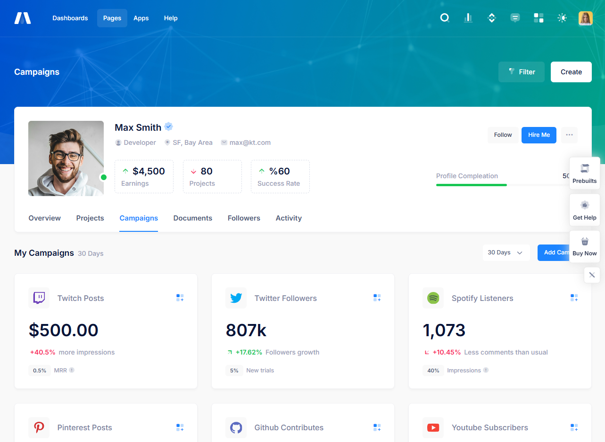

## 10.4 Komponen UI

Komponen UI merupakan elemen-elemen kecil dalam desain yang digunakan untuk membangun antarmuka pengguna yang konsisten dan fungsional. Dalam dokumentasi template Metronics, tersedia panduan yang lengkap mulai dari *layout* hingga komponen-komponen terkecilnya. Pada bagian ini, hanya akan dibahas komponen-komponen yang dianggap fundamental dan memiliki pengaruh dalam terciptanya konsistensi *user interface*.

### 10.4.1 Navigasi

Navigasi adalah elemen yang membantu pengguna berpindah antar layar atau bagian aplikasi. Desain navigasi yang konsisten dan intuitif sangat penting untuk menciptakan pengalaman pengguna yang baik. Dalam template ini, disediakan 2 tipe navigasi, yaitu di bagian atas dan di bagian samping. Untuk keperluan *back office*, admin biasanya menggunakan navigasi di bagian samping (*sidebar*) untuk mengakomodasi jumlah menu yang sering bertambah seiring waktu. Sedangkan untuk landing page atau portal, biasanya menggunakan navigasi di bagian atas dengan mega menu. Dua jenis navigasi ini adalah yang paling umum digunakan dan lebih intuitif untuk digunakan oleh pengguna.

Berikut merupakan contoh navigasi *sidebar* atau *vertical* *navigation bar* pada *header* sebuah website *dashboard*.


Contoh penggunaan navigasi yang diletakkan di atas atau *horizontal navigation bar* pada *header* sebuah website dapat dilihat pada gambar di bawah ini.


**REKOMENDASI:**

- Sebaiknya teks pada menu navigasi mudah terbaca dengan warna yang cukup kontras terhadap latar belakang agar pengguna lebih mudah dalam membaca dan membedakan dengan latar belakang navigasi.
- Menampilkan indikator posisi saat ini agar pengguna mengerti sedang berada di mana. Misalnya dengan meng-*highlight* menu aktif ketika pengguna mengarahkan *mouse* ke suatu menu navigasi. Selain itu, penggunaan *breadcrumb* pada halaman website juga dapat membantu orientasi pengguna.
- Menampilkan tanda visual seperti ikon panah pada item menu yang memiliki *submenu* (*dropdown menu*) untuk membantu pengguna memahami bahwa terdapat pilihan menu navigasi lanjutan yang dapat dibuka.
- Untuk responsivitas, disarankan menggunakan *hamburger* menu pada navigasi untuk layar *mobile* agar menu navigasi tidak saling berimpit dan dapat tersusun dengan baik.

**HINDARI:**

- Menu *dropdown* bertingkat dengan lebih dari dua level. Menu *dropdown* yang memiliki lebih dari dua level atau *tier* cenderung membingungkan dan menyulitkan pengguna.


### 10.4.2 Tombol

Tombol merupakan elemen interaktif yang digunakan untuk melakukan aksi atau navigasi. Desain tombol harus jelas dan mudah dikenali oleh pengguna.

Dalam template Metronics, disediakan beberapa *style button* yang dapat digunakan.

*Basic Button*


*Light Button*


*Outline Button*


*Icons Button*


Tidak ada keharusan dalam pemilihan *style* tombol. Sama seperti ikon, pemilihan *style* sebaiknya konsisten dalam satu *project* agar pengguna tidak kebingungan karena perubahan *style button*. Namun, untuk tombol yang menggunakan ikon, dapat menggunakan ikon dan label atau hanya ikon saja sesuai kebutuhan.

**REKOMENDASI:**

- Bebas menggunakan *style* tombol apapun, dengan catatan konsisten dalam satu *project* yang sama sebagai *style* utama.
- Diperbolehkan menggunakan kombinasi *style* (misalnya, *button solid* dan *light*) untuk mempertegas maksud tertentu pada setiap *button*. Misalnya, pada modal konfirmasi terdapat pilihan “Ya” dan “Tidak”. Tombol “Ya” bisa menggunakan *style solid* sedangkan tombol “Tidak” bisa menggunakan *style light* untuk memberikan kesan bahwa tombol “Ya” adalah tombol yang seharusnya dieksekusi.
- Diperbolehkan menggunakan tombol dengan label saja, ikon saja, maupun kombinasi label dan ikon sesuai kebutuhan dan ketersediaan ruang.
- Jika menggunakan tombol ikon saja (tanpa label), disarankan untuk menambahkan tooltip yang muncul di atas tombol.
- Gunakan warna dan ikon tombol aksi sesuai fungsi.
    
    
    | Tombol | Class | Ikon |
    | --- | --- | --- |
    | tambah | primary | ikon tambah |
    | ubah | warning | ikon pensil |
    | hapus | danger | ikon tempat sampah |
    | detail | primary | ikon mata |
    | export excel | success | ikon file (excel jika ada) |
    | cetak | primary | ikon printer |
    | tampilkan | primary | ikon kaca pembesar |
    | reset | secondary | ikon refresh |
    | kembali | warning | ikon panah kiri |
    | simpan | primary | ikon simpan |
- Meletakkan tombol pada posisi sesuai ketentuan
    
    
    | Tombol | Lokasi |
    | --- | --- |
    | tampilkan, reset | di bagian kanan bawah *form filter.* Secara berurutan, dari yang paling kanan ke kiri, terdapat tombol Tampilkan, diikuti dengan tombol *Reset.* |
    | tambah | di bagian kanan atas dari panel utama (panel yang memuat data isian/tabel/daftar). |
    | export, cetak | di bagian kanan atas dari panel utama (panel yang memuat data isian/tabel/daftar). Tombol Export dan tombol Cetak dapat saling bertukar posisi, namun harus tetap berada di sebelah kiri dari tombol Tambah. |
    | detail, ubah, hapus | di dalam panel utama, tombol-tombol ini biasanya diletakkan pada tabel yang berada di kolom aksi yang terletak di paling kanan, berjajar secara horizontal. Alternatif lainnya adalah dengan menggunakan satu *button group* yang berisi tombol Detail, Ubah, dan Hapus yang dapat membuka menu di atasnya. Untuk tombol Ubah dan Hapus, sebaiknya selalu diletakkan selalu bersebelahan dan berada di ujung kanan. |
    | detail | selain menggunakan tombol aksi, tombol Detail dapat ditempatkan pada “data utama” yang *unique* (misalnya nomor transaksi pada daftar transaksi), kemudian diberikan label yang akan menjadi tombol yang dapat diklik. |
    | tombol aksi tambahan (contoh: Upload, Ajukan, dll) | tombol aksi tambahan dapat diletakkan setelah tombol Detail dan sebelum grup tombol Ubah, Hapus. |
    | simpan, kembali | di bawah form, sebelah kanan. Tombol Simpan terletak di paling kanan dan tombol Kembali di sebelah kiri. Atau, tombol Simpan berada di ujung kanan dan tombol Kembali di ujung kiri. |
    | pagination | di bawah, sebelah kanan. Apabila tabel/data terlalu panjang, pagination dapat ditambahkan di atas tabel/data, sebelah kiri, berlawanan dengan kelompok tombol Tambah, Export, dan Cetak. Untuk halaman utama *landing page* dapat diletakkan di bawah dan di tengah. |

**HINDARI:**

- Penggunaan ikon yang tidak sesuai dengan label tombol.
- Penukaran warna tombol aksi yang telah ditentukan, karena dapat menimbulkan *misinterpretation* atau kesalahpahaman oleh pengguna.

### 10.4.3 Formulir/*Form*

Formulir adalah komponen yang digunakan untuk mengumpulkan input dari pengguna. Komponen formulir yang umum digunakan antara lain *input* teks, *dropdown*, *checkbox*, dan *radio button*. Pada template Metronics, terdapat berbagai variasi *style* *form* terutama pada *tag* `<input>`.

Berikut merupakan variasi *style* pada *form input*

*Style Fill*


*Style Label*


Untuk *style* lainnya yang lebih lengkap (dasar/*basic* dan lanjutan/*advance*) dapat dilihat langsung pada dokumentasi melalui [tautan berikut ini](https://preview.keenthemes.com/html/metronic/docs/base/forms/controls).

**REKOMENDASI**:

- Gunakan *style outline* untuk kemudahan akses pengguna atau gunakan *style solid* untuk lebih menekankan estetika.
- Selain *input*, *template* juga menyediakan *styling* untuk *checkbox* dan *radio button*.
- Gunakan *style* dan *size form* yang konsisten sama dalam satu *project*.
- Gunakan *masking* untuk menampilkan nominal dalam *form*.
- Apabila menggunakan *icon*, pastikan *icon* yang digunakan seuai dengan isian *form*. Jika tidak menemukan yang sesuai, lebih baik tidak menggunakan *icon*.
- Selalu gunakan *select2* untuk *dropdown* karena fitur pencariannya sangat dibutuhkan pengguna.
- Untuk mendapatkan panjang yang seragam, beberapa *form* dapat digabung dalam satu atau beberapa baris kelompok. Contohnya adalah input untuk kelurahan, kecamatan, kabupaten, provinsi, atau *password* dan *re-type password.*

**HINDARI**:

- Menggunakan *style input form* yang transparan.
- Menggunakan *placeholder* apabila keterangannya sama dengan label.
- Menggunakan *radio button* dan *checkbox* tanpa *styling* dari *template* karena dapat merusak tatanan antarmuka akibat bentuk yang kontras.
- Membuat daftar *form* dengan panjang yang berbeda.

### 10.4.4 *Card*/Panel

*Card*/Panel adalah komponen yang digunakan untuk menampilkan informasi atau konten dalam satu wadah dengan format yang terstruktur dan mudah dibaca. *Card* sering digunakan untuk menyajikan data atau objek dengan berbagai elemen seperti gambar, teks, dan tombol dengan memanggil *class* `card`. Secara umum *card* terdiri dari 3 bagian, yaitu *header*, *body* dan *footer*. Header pada *card* biasanya berisi *title*/judul atau bisa juga terdapat *icon* aksi pada sebelah kanan *title*. *Body* pada *card* berisi konten atau informasi dan *footer* biasanya berupa *CTA button*.

Contoh penggunaan *card* dengan struktur *header* dan *body* adalah sebagai berikut.

Contoh lain penggunaan *card* dengan struktur *header*, *body* dan *footer* adalah sebagai berikut.


**REKOMENDASI**:

- Tidak semua bagian *card* diperlukan, jadi gunakan hanya bagian yang sekiranya dibutuhkan.

**HINDARI:**

- Meletakkan tombol pada *footer card* karena dapat membuat *footer* terlihat gemuk; sebaiknya diletakkan di *body card*.
- Menggunakan *card* dalam *card*, atau menambahkan *margin* dan *padding* pada *card* karena akan membuang banyak ruang.

### 10.4.5 *Modal*

*Modal* adalah jendela interaktif yang muncul di atas konten aplikasi untuk menampilkan informasi penting atau meminta *input* dari pengguna tanpa meninggalkan halaman yang sedang dilihat. 

Contoh penggunaan *modal* adalah sebagai berikut.


Pada gambar di atas, *modal* tetap berada pada halaman yang sama dan terdapat warna latar belakang yang lebih gelap untuk meningkatkan visibilitas dari modal tersebut.

Selain itu, modal juga dapat ditumpuk atau dapat disebut dengan *stacking modal*. Contoh penggunaan *stacking modal* (*modal* yang bertumpuk) adalah seperti pada gambar di bawah ini.

*Stacking modal* sebaiknya berjumlah tidak lebih dari dua *layer* atau tingkat karena *stacking modal* yang terlalu banyak dapat menganggu kenyamanan pengguna. 

**REKOMENDASI**:

- Gunakan ukuran *modal* sesuai dengan konten. Apabila konten banyak, dapat menggunakan *modal* dengan ukuran besar.
- Jika ragu mengenai *size modal* yang akan digunakan, sebaiknya pilih *modal* dengan ukuran sedang.

**HINDARI:**

- Menumpuk *modal* (*stacking*) lebih dari dua. Demi kenyaman pengguna, maksimal *stacking modal* hanya dua. Jika memungkinkan, usahakan menggunakan satu *modal* saja. Apabila terpaksa menggunakan dua *modal*, maka *modal* kedua haruslah berupa *modal* “*prompt*”.

### 10.4.6 *Loading* & *State* Kosong

Indikator *loading* digunakan untuk memberitahukan pengguna bahwa aplikasi sedang memproses atau mengambil data sehingga pengguna mengetahui bahwa aplikasi belum selesai merespons. Contoh penggunaan *loading* pada website SIMASTER adalah sebagai berikut.


Salah satu jenis *loading* yang dapat meningkatkan pengalaman pengguna (*user experience*) adalah *skeleton screen*. *Skeleton screen* adalah tampilan antarmuka yang menampilkan struktur dasar atau *layout* sebelum konten sebenarnya dimuat. Contoh penggunaan *skeleton screen* pada website Figma adalah sebagai berikut.


Selain itu, terdapat juga istilah *state* kosong, yaitu kondisi di mana aplikasi tidak memiliki data atau informasi untuk ditampilkan dan perlu memberi tahu pengguna bahwa tidak ada konten yang tersedia saat ini. 

**REKOMENDASI**:

- Gunakan *loader* hanya pada komponen yang sedang diproses atau gunakan *loader* untuk satu halaman penuh.
- Gunakan *loader* hingga tombol aksi yang digunakan tertutup, agar mencegah klik berulang, atau nonaktifkan tombol yang telah di klik hingga proses selesai.

**HINDARI**:

- Menampilkan hasil kosong tanpa keterangan.

### 10.4.7 Notifikasi/*Alert*

Notifikasi/*Alert* digunakan untuk memberikan informasi penting kepada pengguna, baik berupa pesan kesalahan, peringatan, atau konfirmasi dari suatu aksi. Contoh penggunaan notifikasi atau *alert* setelah pengguna melakukan suatu aksi atau perubahan adalah sebagai berikut.


**REKOMENDASI**:

- Gunakan `prompt` untuk memberikan respon notifikasi.
- *Prompt* sebaiknya muncul di pojok kanan atas.
- Untuk notifikasi berhasil, gunakan warna *primary*, sedangkan untuk yang gagal, gunakan warna *danger*.
- Gunakan `alert` untuk menampilkan informasi tambahan (bukan respon dari suatu aksi).

**HINDARI**:

- Menggunakan *alert* sebagai notifikasi.

### 10.4.8 *Prompt*/Konfirmasi

*Prompt* atau konfirmasi diperlukan untuk mengonfirmasi ulang suatu aksi guna menghindari ketidaksengajaan. Umumnya, *prompt* dibuat dengan *modal size small*, dilengkapi dengan redaksional tambahan dan tombol aksi konfirmasi.

*Prompt* yang akan digunakan terdiri dari 4 bagian, yaitu:

1. *Icon* aksi (wajib)
2. Konfirmasi utama (wajib)
3. Deskripsi tambahan (opsional)
4. Tombol aksi (wajib), dengan posisi ***TRUE*** di sebelah kanan dan ***FALSE*** di sebelah kiri

Berikut adalah contoh *prompt* yang direkomendasikan:

```html
<div class="modal-body pt-0">
    <div class="text-center mb-4">
				<i class="ki-duotone ki-trash text-danger fs-5x">
						<span class="path1"></span>
						<span class="path2"></span>
						<span class="path3"></span>
						<span class="path4"></span>
						<span class="path5"></span>
				</i>
    </div>
    <div class="text-center">Are you sure wanna get rid of this data?</div>
    <div class="small text-center mt-2 text-muted">
	    Deleted data can't be restored forever
	  </div>
    <div class="text-center mt-10">
        <button type="button" class="btn btn-light" data-bs-dismiss="modal">Cancel</button>
        <button type="button" class="btn btn-danger ms-3">Sure</button>
    </div>
</div>
```


