## 10.5 *Layout*

Dalam pengembangan aplikasi berbasis web di lingkungan internal universitas, konsistensi tata letak (*layout*) memegang peranan penting untuk memastikan pengalaman pengguna yang seragam di seluruh sistem. *Layout* yang terstandar tidak hanya memudahkan pengguna untuk beradaptasi dengan berbagai sistem, tetapi juga mencerminkan identitas universitas yang profesional dan terintegrasi.

Bagian ini menyajikan pedoman tata letak utama yang harus diikuti oleh pengembang, mencakup elemen-elemen penting seperti susunan *form*, tabel data, navigasi, dan *modal*. Standarisasi ini bertujuan agar setiap aplikasi internal memiliki struktur halaman yang intuitif, estetis, dan sesuai dengan praktik desain modern. Dengan mengikuti pedoman ini, setiap pengembangan mandiri oleh fakultas atau unit dapat tetap sejalan dengan prinsip desain yang telah ditetapkan.

Tata letak yang direkomendasikan berikut juga dilengkapi dengan contoh visual untuk mempermudah implementasi oleh pengembang.

### **10.5.1 Layout Dasar Halaman**

Penempatan *Header*, *Sidebar*, dan Konten Utama

- *Header*
    
    Bagian *header* merupakan kumpulan menu yang biasa digunakan pada portal Simaster. Secara umum, mencakup menu, notifikasi, dan informasi profil pengguna. Letak header berada di bagian teratas halaman dan akan *sticky* atau tetap terlihat meskipun pengguna melakukan *scroll down* kebawah halaman 
    
- *Sidebar*
    
    *Sidebar* berisi menu-menu yang akan menavigasi pengguna ke halaman-halaman yang ada pada sistem. *Sidebar* terletak di bagian paling kiri halaman.
    
- Konten utama
    
    Konten utama adalah pusat data yang akan ditampilkan di sistem. Letaknya berada di bawah header dan di sebelah kanan *sidebar*. 
    

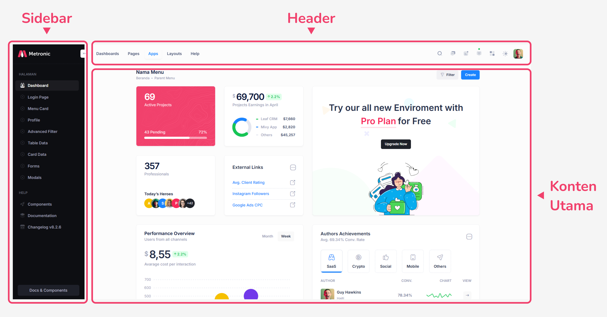

### 10.5.2 Struktur Formulir

Tata letak elemen *input*, tombol aksi, dan validasi

- *Form* disusun secara vertikal (baris demi baris).
- Label dapat memiliki 2 tipe, yaitu selalu di atas *input*, atau di samping *input*. Penggunaan label pada *input* harus konsisten di semua sistem yang terkait.
    - Label ditempatkan di sisi kiri *input*:
    
    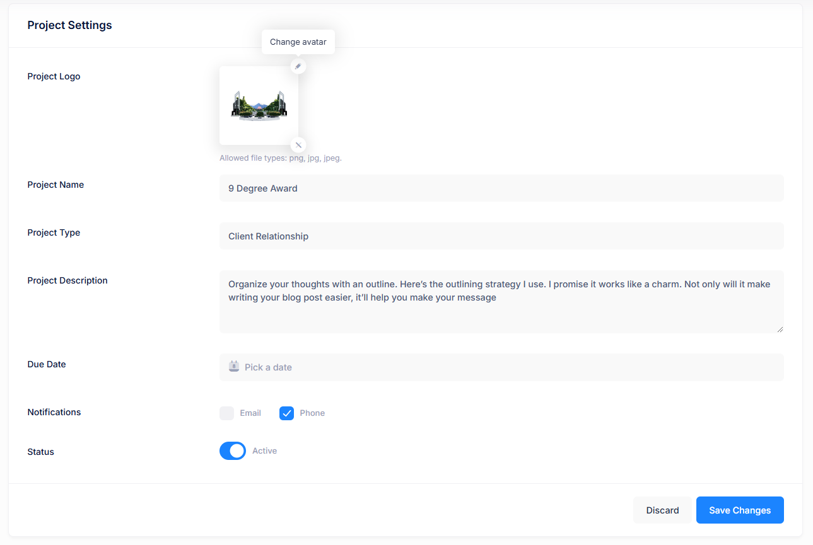
    
    - Label ditempatkan di sisi atas *input*:
    
    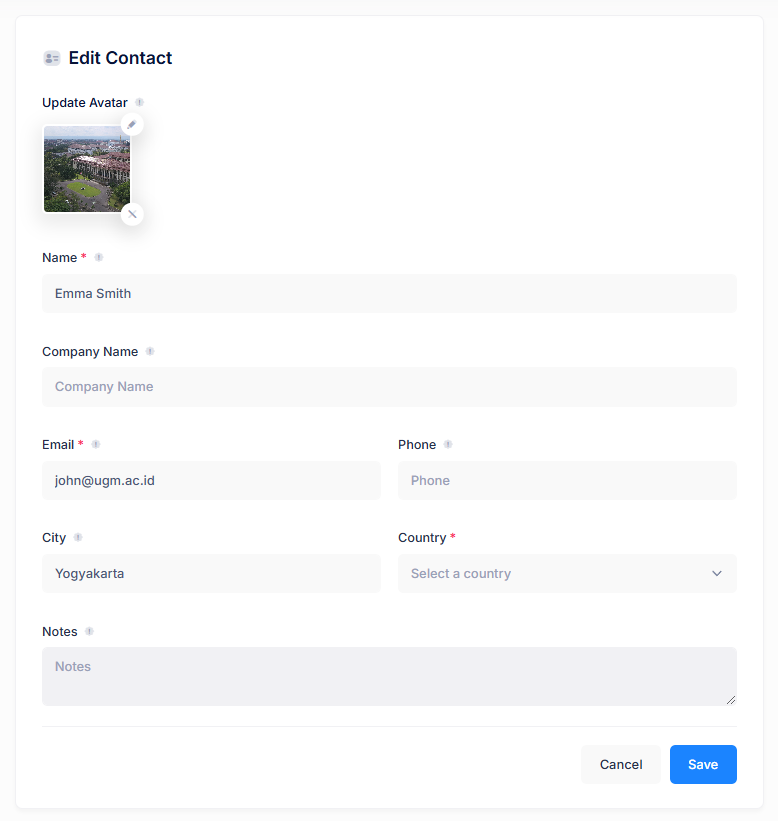
    
- Tambahkan *placeholder* untuk penjelasan tambahan.
    
    *Placeholder* ini berfungsi sebagai informasi tambahan yang ditampilkan ketika input belum diisi. 
    
- Tombol *Submit* atau Simpan ditempatkan di pojok kanan bawah.

### 10.5.3 Struktur Table

Desain tabel dengan filter, pagination, dan aksi baris.

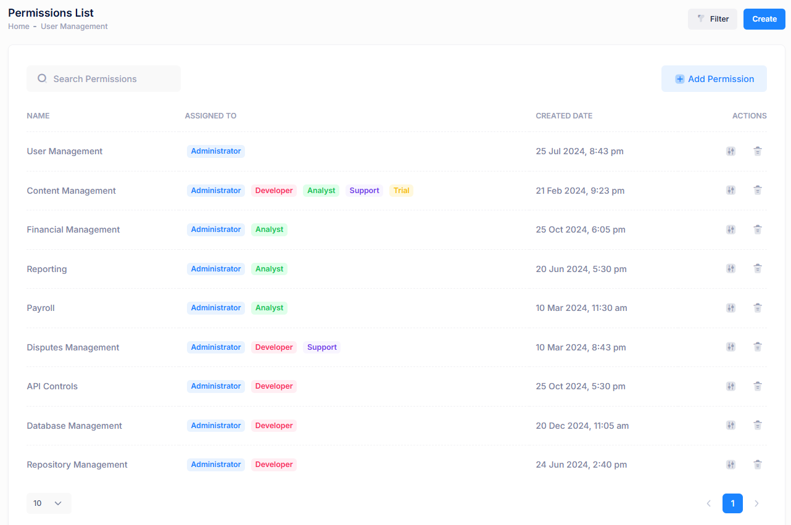

- **Header tabel:** harus dicetak tebal ***(bold)*** dengan menggunakan huruf kapital seluruhnya atau *capitalize* (huruf besar diawal setiap kata).
- **Baris tabel:** harus memiliki pembatas untuk memisahkan data antara setiap baris, agar lebih jelas dan mudah dibaca.
- Tambahkan tombol aksi di sisi kanan setiap baris, seperti tombol aksi Lihat, Edit, dan Hapus.
    - Tombol aksi dapat berupa sebuah tombol yang memiliki banyak opsi. Ketika tombol tersebut diklik, akan menampilkan beberapa aksi sekaligus.
         
        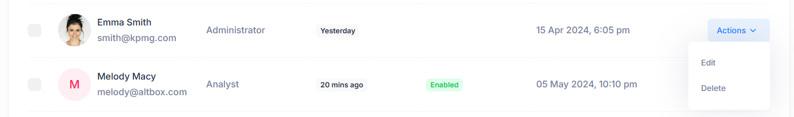
        
    - Tombol aksi juga bisa berupa ikon yang merepresentasikan aksi tertentu, seperti ikon tong sampah untuk menghapus, ikon pensil untuk mengedit, dan lainnya.
        
        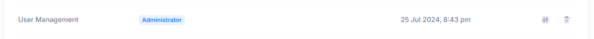
        
- **CTA Button**: Tombol aksi utama seperti Tambah, Export, dan lainnya, harus ditempatkan di pojok kanan atas tabel. Tombol ini digunakan untuk tindakan penting yang berkaitan langsung dengan tabel.
- **Filter:** Sediakan fitur filter di atas tabel, diikuti dengan tombol "*Apply Filter*" atau "Reset."
    - Untuk fitur filterisasi dengan banyak parameter, disarankan untuk menggunakan pendekatan modal guna mengoptimalkan ruang dan menjaga tampilan tetap rapi dalam satu halaman.
        
        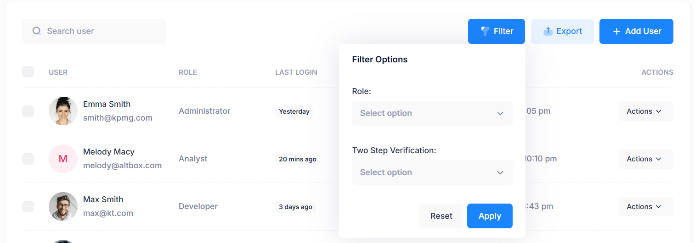
        
    - Apabila *parameter filter* yang tersedia hanya 1 atau 2, disarankan untuk meletakkan *filter* langsung pada bagian *header table.* Hal ini bertujuan untuk mengoptimalkan ruang dan mempermudah akses pengguna dalam melakukan *filter.*
        
        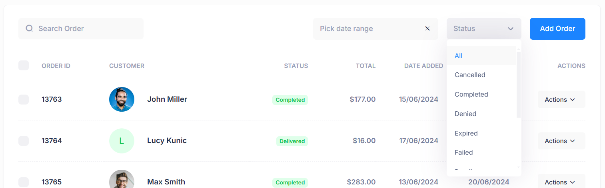
        
    - Alternatif lain adalah dengan menggunakan pendekatan tambahan panel di sebelah kiri halaman sebagai tempat filter. Pendekatan ini dapat memberikan ruang yang lebih luas untuk menampilkan lebih banyak parameter filter jika diperlukan.
        
        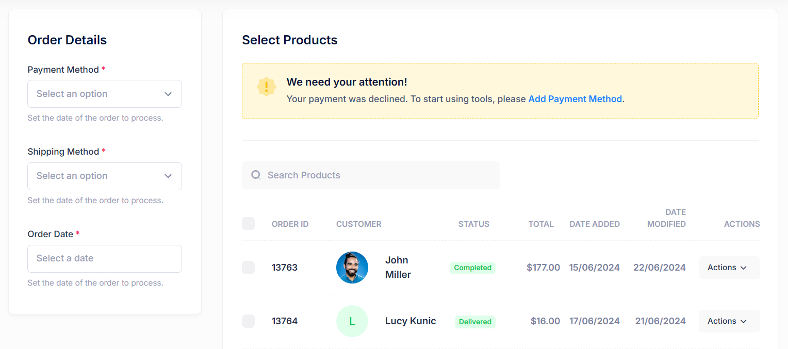
        
- **Search**: Sediakan *input search* untuk memudahkan pengguna dalam mencari data yang ada dalam tabel. Input pencarian ini harus ditempatkan di bagian atas tabel agar mudah diakses.
- **Pagination:** Tambahkan navigasi halaman di bawah tabel untuk memungkinkan pengguna berpindah antar halaman data yang lebih banyak. Navigasi ini dapat mencakup tombol *Previous*, *Next*, serta nomor halaman untuk mempermudah navigasi.
- Tambahkan dropdown list pada pojok kanan bawah tabel untuk mengatur jumlah data yang ditampilkan per halaman. Opsi yang dapat disediakan antara lain seperti 10 data, 20 data, 50 data, dan seterusnya. Hal ini memberikan fleksibilitas kepada pengguna untuk memilih jumlah data yang ingin ditampilkan sesuai dengan preferensi mereka.

### 10.5.4 Struktur Modal

Penempatan konten modal, tombol aksi, dan tata letak. 

- Ukuran modal sesuaikan kebutuhan:
    - Small Modal (Ukuran terkecil)
    
    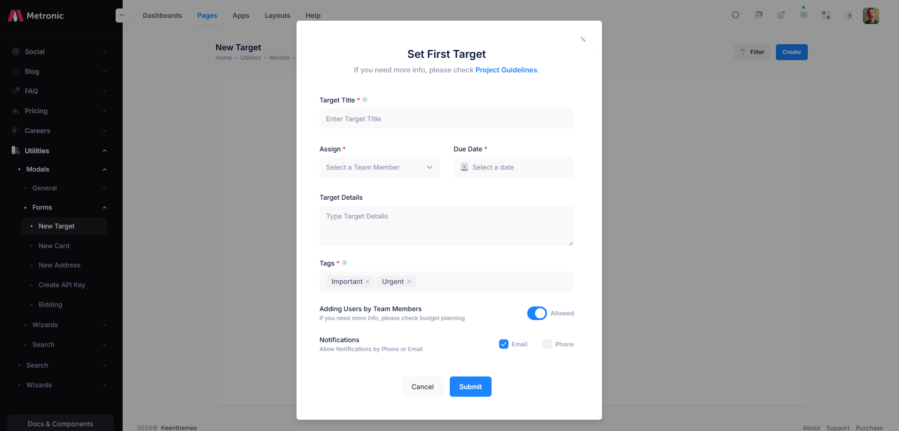
    
- Medium Modal (Ukuran medium)
    
    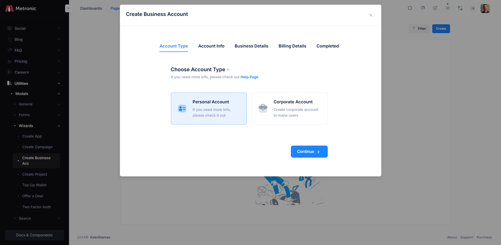
    
- Full Modal (Ukuran penuh)
    
    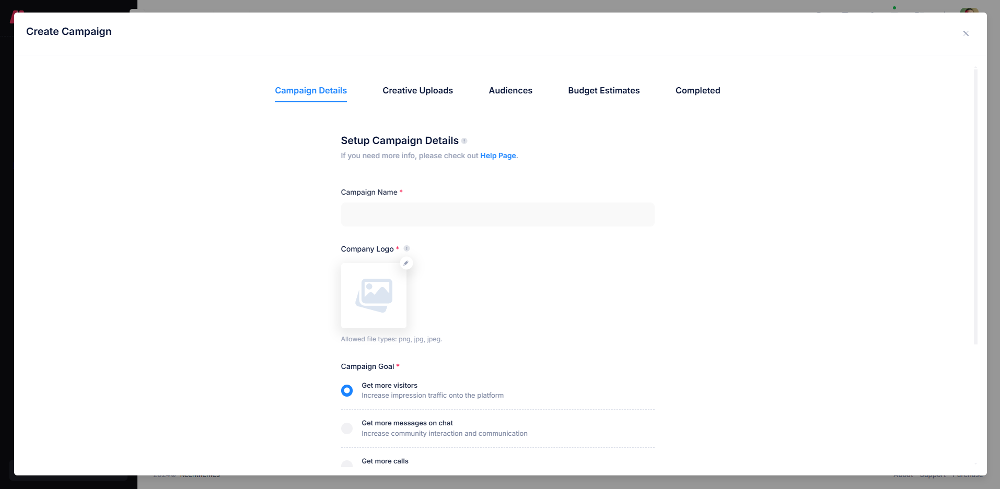
    
- Penempatan modal: modal selalu muncul di tengah layar dengan *background overlay* transparan.
- Struktur modal:
    - Judul modal ditempatkan di bagian atas modal (misalnya: “Tambah Data” atau “Edit Data”).
    - Konten modal ditempatkan di bagian tengah modal (misalnya berupa *form*, teks penjelasan atau yang lain).
    - Tombol aksi ditempatkan di bagian bawah modal (misalnya: aksi "Simpan" dan "Batal").
    - Modal harus memiliki tombol "*Close*" atau ikon "X" di sudut kanan atas untuk menutup modal, jika tidak ingin melanjutkan aksi.

### 10.5.6 Profil

Desain halaman ini khusus untuk menampilkan profil pengguna, seperti dosen, tenaga kependidikan (tendik), atau mitra. Struktur halaman menempatkan informasi utama di bagian atas (hero section) dan atribut lainnya di bagian bawah. Jika terdapat banyak data dengan kategori yang beragam, dapat menggunakan tab untuk memisahkan data.

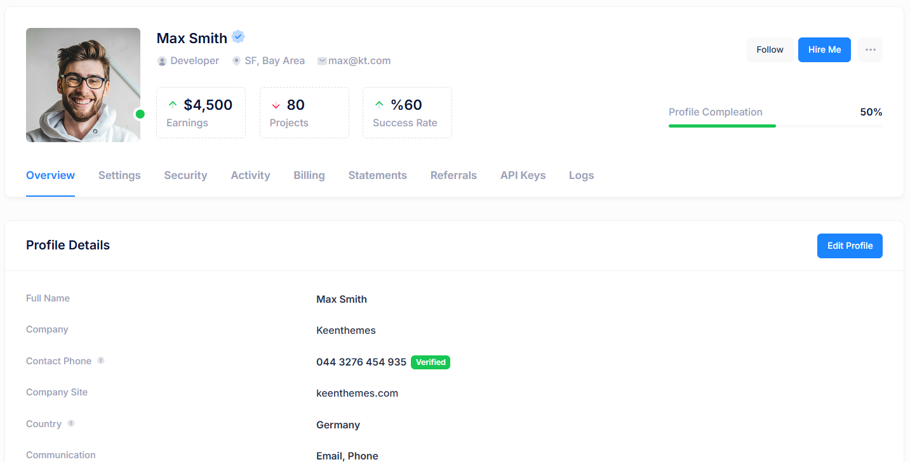

Untuk data statis ditampilkan dengan struktur label di sebelah kiri dan isian data di sebelah kanan, disusun rapi menyesuaikan panjang kontennya. Adapun untuk data dinamis berupa *form input*, susunannya mengikuti struktur *form* sebagaimana dijelaskan di poin **10.5.2 Struktur *Form*** diatas.

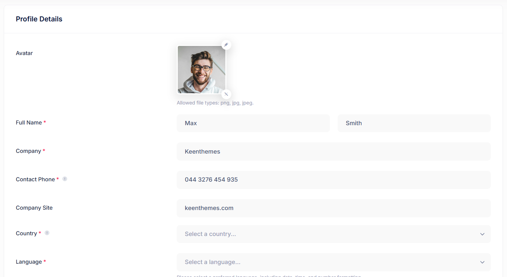

### 10.5.8 Halaman lain

Selain komponen utama seperti form, tabel, dan navigasi, sistem informasi internal universitas sering kali memerlukan halaman khusus yang dirancang untuk memenuhi kebutuhan tertentu. Halaman-halaman ini, meskipun tidak selalu menjadi bagian dari alur utama pengguna, tetap memegang peranan penting dalam memberikan pengalaman yang lengkap, fungsional, dan konsisten.

1. Halaman login
    
    
    
2. Halaman Dashboard
    
    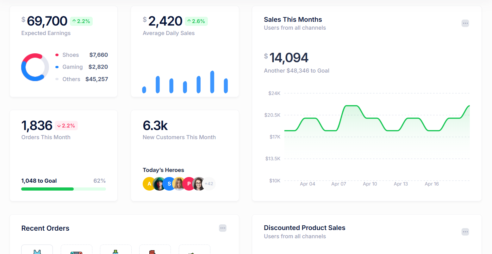
    
3. Halaman Persuratan
    
    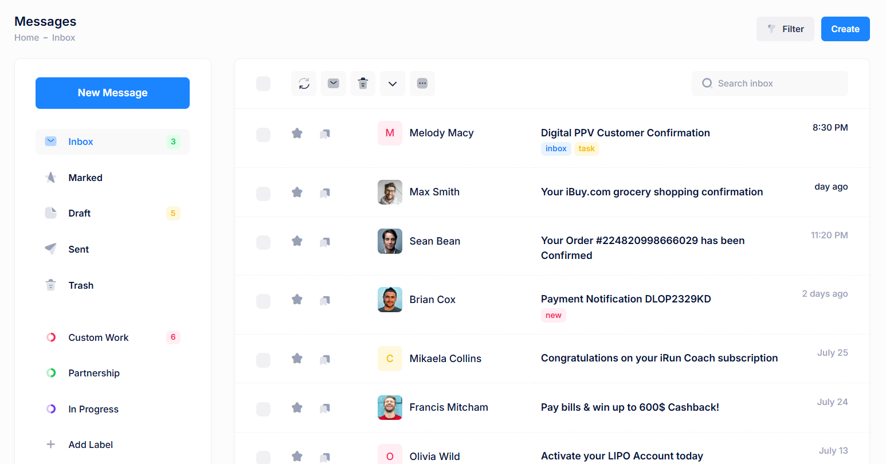
    
4. Kalender Jadwal
    
    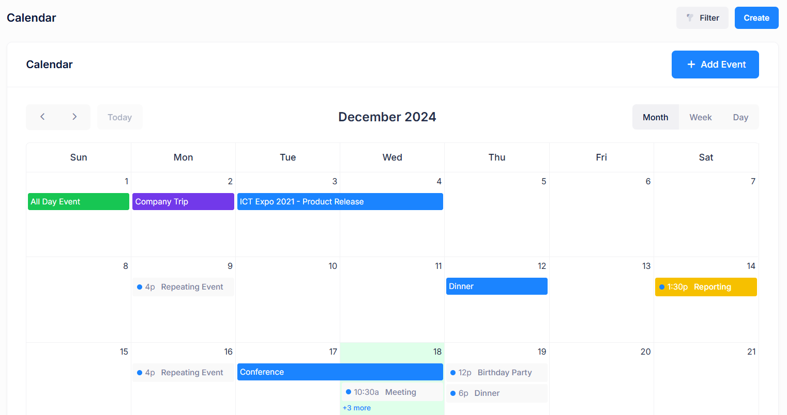
    
5. Halaman Error 404, 500, dan lain-lain
    
    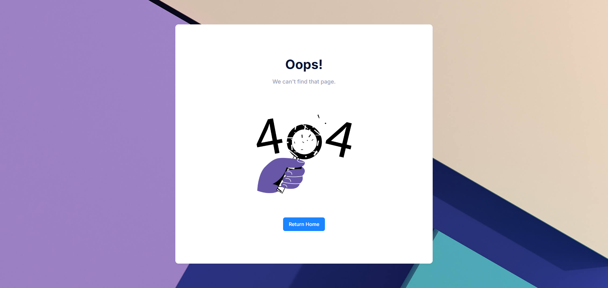
    
    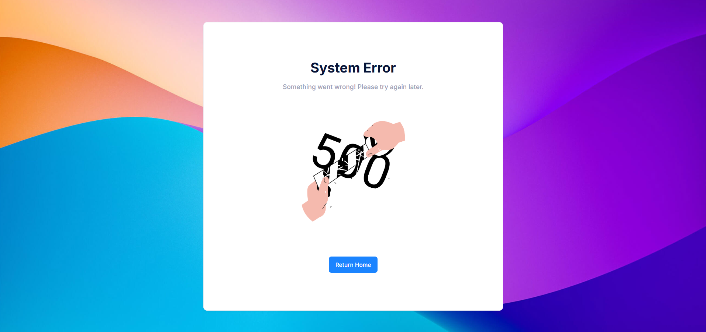
    

Pedoman ini memberikan panduan visual dan fungsional untuk setiap jenis halaman, mencakup tata letak elemen, hierarki konten, dan penggunaan komponen desain yang sesuai. Dengan menerapkan standar ini, pengembang dapat memastikan bahwa setiap halaman, meskipun bersifat khusus, tetap harmonis dengan sistem utama.